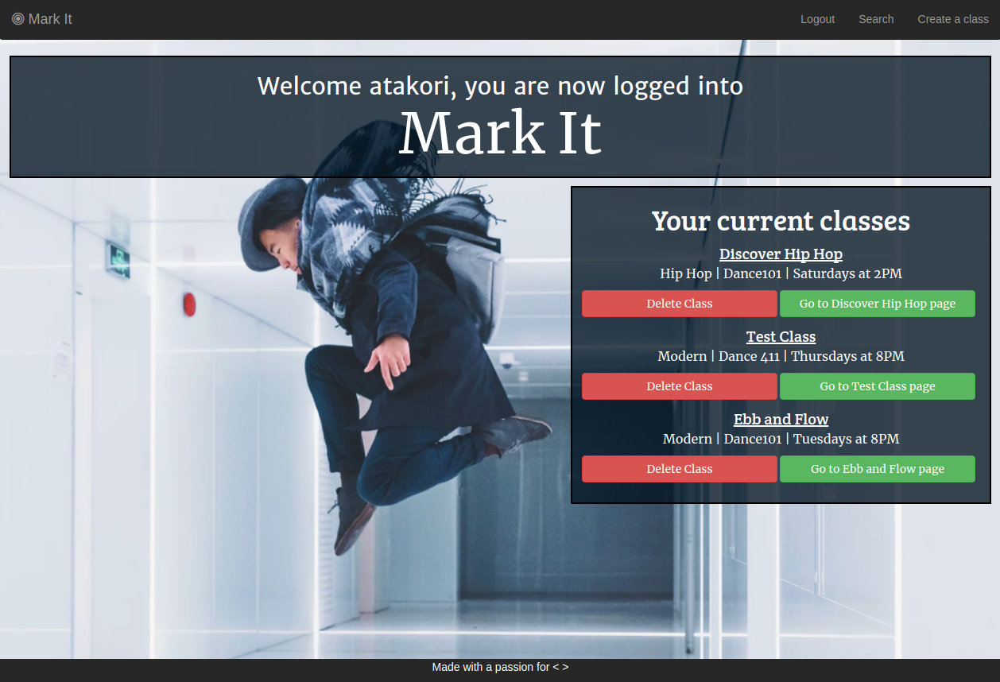

#Mark-It-App

-------
Summary
-------
Mark it is an app that allows users to easily upload and view daily dance classes. 
Choreographers can create classes and upload videos to them to keep them in one easy to access site. 
Dancers can also add these classes to their accounts to make sure they never miss a class video!
When a user creates their own class, they become the adminstrator of that created class. The administrators currently
have the ability to delete classes from the database. However, administrative features will be extended in future 
versions of the application.

-----------------
Technologies Used
-----------------
Front-end: HTML, CSS, Javascript, Jquery
Back-end: Node.js, MongoDB, Mocha, Cloudinary
